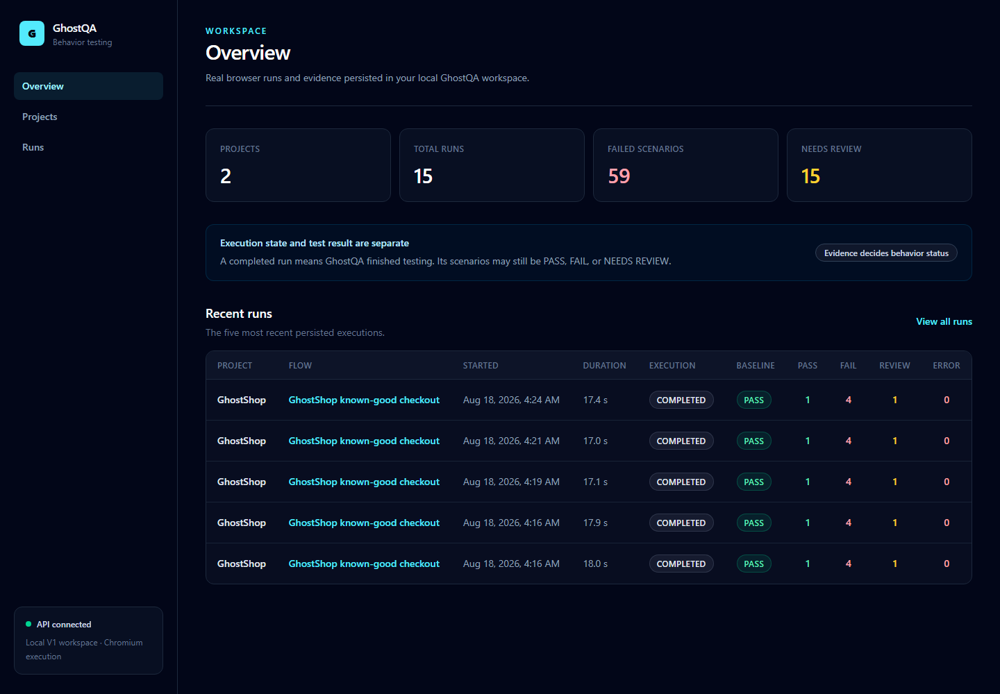
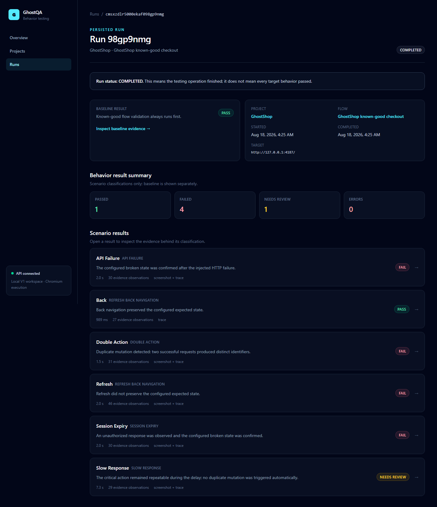
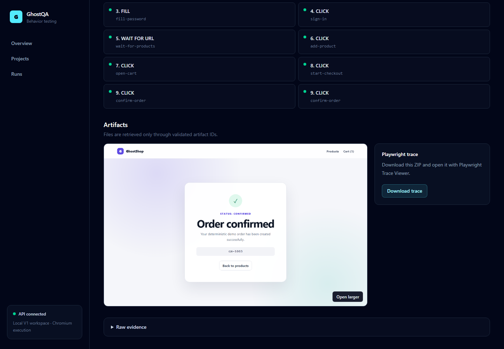

# GhostQA

**Adaptive Web Behavior Testing Platform**

GhostQA captures or imports a known-good web journey, replays it under controlled
failure and user-behavior conditions in a real Chromium browser, and produces
evidence-backed `PASS`, `FAIL`, `NEEDS_REVIEW`, or `ERROR` results.

GhostQA V1 is implemented and ready for local or explicitly allowlisted staging
demonstration. It is not presented as a production scanning service.



## Why it exists

A traditional end-to-end test proves that an expected happy path works. It
usually says less about rapid duplicate input, failed or delayed APIs,
navigation at a critical checkpoint, or an expired session. GhostQA adds that
behavioral and fault-testing layer without replacing unit, integration, or
ordinary E2E tests.

## How it works

```mermaid
flowchart LR
    I[Semantic browser capture] --> B[Normalized baseline]
    B --> V[Validate baseline]
    V --> M[Apply configured scenario mutation]
    M --> C[Run in isolated Chromium context]
    C --> O[Observe browser and network behavior]
    O --> R[Classify conservatively]
    R --> P[Persist evidence and artifact metadata]
    P --> D[Inspect in dashboard]
```



Every full run validates the baseline first. A failed baseline is persisted and
stops scenario execution. GhostQA first proposes a focused plan of only the
applicable scenario instances, then runs the enabled instances sequentially in
isolated browser contexts. Deterministic classifiers use observed evidence;
ambiguous behavior becomes `NEEDS_REVIEW`, never invented certainty.

## V1 scenarios

GhostQA V1 supports exactly five scenario families:

- **Double Action** — triggers the critical action twice and can prove distinct
  outcomes from fingerprinted high-confidence JSON identifiers.
- **API Failure** — returns HTTP 500 and automatically observes assertion,
  critical-control recovery, semantic status, and browser-error evidence;
  explicit expected states remain available.
- **Slow Response** — delays a configured request and automatically observes
  critical-control pending/repeatability state, mutation count, and final state.
- **Refresh / Back Navigation** — refreshes or navigates back at a configured
  checkpoint and verifies expected state. Refresh and Back are separate
  instances of this family.
- **Session Expiry** — injects HTTP 401 or clears configured browser state and
  checks recovery behavior.

## Tech stack

- **Frontend:** React, TypeScript, Vite, Tailwind CSS, TanStack Query
- **Backend:** Node.js, TypeScript, Express, Zod
- **Database:** SQLite with Prisma
- **Browser automation:** Playwright with Chromium
- **Testing:** Vitest, Testing Library, Node test runner, Playwright
- **Repository:** npm workspaces

## Architecture

```text
apps/dashboard       React dashboard and typed API client
apps/server          Express API, validation, orchestration, Prisma, artifacts
apps/demo-target     GhostShop controlled fixture and real-browser proofs
packages/shared      Stable cross-workspace TypeScript contracts
packages/test-engine Persistence-free Playwright baseline/scenario engine
```

Dependency direction and runtime details are documented in
[docs/ARCHITECTURE.md](docs/ARCHITECTURE.md).

## Quick start

Requirements: Node.js 20 or newer and npm.

```bash
npm install
npm run playwright:install
npm run db:migrate
```

Start the three applications in separate terminals:

```bash
# Terminal 1 — deliberately buggy target fixture
npm run demo:dev

# Terminal 2 — GhostQA API and execution orchestration
npm run server:dev

# Terminal 3 — GhostQA dashboard
npm run dashboard:dev
```

With GhostShop and the server running, seed its project, flow, and six scenario
instances idempotently:

```bash
npm run demo:seed
```

Open `http://127.0.0.1:5173`, select GhostShop, open its flow, and choose
**Run tests**.

Default ports and local storage:

| Component | Default |
| --- | --- |
| GhostShop fixture | `http://127.0.0.1:4173` |
| GhostQA API | `http://127.0.0.1:4000` |
| Dashboard | `http://127.0.0.1:5173` |
| SQLite | `apps/server/prisma/dev.db` |
| Screenshots/traces | `artifacts/runs/<run-id>/` |

All defaults work without an `.env` file. See [.env.example](.env.example) for
optional ports, CORS origins, target hosts, API URL, and artifact-root settings.
The SQLite file and ordinary runtime artifacts are ignored by Git.

Automated server and persisted-browser tests never use that development
database. Each test invocation creates a uniquely named SQLite database in the
operating-system temporary directory, applies every checked-in migration,
supplies an explicit absolute `DATABASE_URL`, and removes the database
afterward. Test mode refuses to use `apps/server/prisma/dev.db`. The manual
`demo:seed` and `demo:persisted-run` commands intentionally use the configured
development server; their `demo:test:*` counterparts use an isolated server and
database.

## Interactive baseline capture

For a new target, create a project with its allowlisted URL and choose
**Capture first flow**. GhostQA opens a dedicated headed Chromium window. Perform
the known-good journey there, return to the dashboard, and choose **Stop
capture**. Review the semantic steps, add user-confirmed assertions at
meaningful points, and optionally confirm a critical click plus mutation request
when one exists. Then save, replay the baseline, review the automatically
generated **Focused plan**, and run it or choose **Customize test plan**.

```text
Create Project -> Capture first flow -> perform journey -> Stop
  -> Review -> Save -> Replay Baseline -> Focused plan
  -> Run tests -> Inspect evidence
```

Capture observes rendered DOM/accessibility interactions, URL changes, and safe
network metadata. It does **not** record screen pixels or video and does not need
the target's source repository. The saved result is the ordinary
`NormalizedFlow` consumed by the existing baseline and scenario engines. A
flow may contain multiple step-bound assertions plus the backward-compatible
final assertion. Read-only flows do not need a critical action. **Advanced /
Import baseline JSON** remains available.

Final-page suggestions prioritize short visible headings and status/alert text.
They are clickable suggestions only; the user confirms every business
expectation. Test-plan recommendations are deterministic—not AI—and derive only
from captured steps, selected critical metadata, URL transitions, and the five
supported contracts. The focused test budget selects only justified, ready
instances; Session Expiry is never inferred without authentication evidence.
Missing configuration is shown explicitly. Scenario JSON import remains under
**Advanced** rather than the normal workflow.

A Project represents one target application; a Flow represents one captured
journey within it. Existing projects expose **Capture another flow**, and each
flow keeps independent assertions, critical metadata, test plan, and runs.

Password inputs are marked sensitive and masked in dashboard flow views and the
capture editor. For local/staging V1, the value must still be stored in the
flow's SQLite JSON so Chromium can replay it; there is no secrets vault or
at-rest encryption. Capture sessions and drafts are in server memory, expire,
and are lost when the server restarts.

## GhostShop demo

GhostShop is a separate, deliberately buggy storefront fixture. It is not the
GhostQA product. Its public fixture credentials are `demo@ghostqa.dev` /
`ghost123`.

It contains four deterministic defects:

1. duplicate orders from rapid confirmation;
2. broken recovery after HTTP 500;
3. checkout state loss after refresh;
4. broken recovery after session expiry.

The fixture configuration supplies all GhostShop routes, copy, selectors,
credentials, and expected observations. None are built into the reusable
engine, API services, or dashboard.

## Example real result

One actual local GhostShop run produced:

```text
Baseline: PASS
Double Action: FAIL
API Failure: FAIL
Slow Response: PASS
Refresh: FAIL
Back: PASS
Session Expiry: FAIL
```

These are observed demo results, not hard-coded product behavior. Slow Response
passes because the real browser proves one mutation, a stable pending control,
a passing final assertion, and no unexpected page error.



## Evidence

Each result can include structured injection/assertion entries, network status
and timing, console/page errors, final URL, executed steps, assertion outcome,
a screenshot, and a Playwright trace. SQLite stores validated JSON and artifact
metadata; screenshot and trace binaries stay on disk. The dashboard requests
artifacts by database ID through a path-contained server endpoint.



## Safety

Targets are restricted to `localhost`, `127.0.0.1`, or exact staging hosts
explicitly configured in `ALLOWED_TARGET_HOSTS`. HTTP(S) is required, embedded
URL credentials are rejected, request bodies are not captured as evidence, and
scenario configuration is validated data rather than executable JavaScript.
GhostQA V1 is not a crawler, vulnerability scanner, load tester, or public-site
scanning service.

## V1 limitations

- Chromium only
- sequential, in-process execution
- local SQLite and filesystem artifacts
- localhost or explicitly allowlisted staging targets
- transient, single-process baseline capture sessions
- password values are masked in the UI but stored locally for replay
- no AI or LLM scenario generation
- no CI/CD integration, scheduling, queues, or distributed workers
- no GhostQA accounts, teams, or hosted deployment

## Development commands

| Command | Purpose |
| --- | --- |
| `npm run dashboard:dev` | Start the dashboard |
| `npm run server:dev` | Build shared packages and start the API |
| `npm run demo:dev` | Start GhostShop |
| `npm run db:migrate` | Apply checked-in Prisma migrations |
| `npm run db:status` | Show Prisma migration status |
| `npm run demo:seed` | Seed GhostShop idempotently |
| `npm run demo:baseline` | Run the direct baseline demonstration |
| `npm run demo:scenarios` | Run all direct scenario demonstrations |
| `npm run demo:persisted-run` | Run through the persisted backend |
| `npm run demo:test:baseline` | Real Chromium baseline proof |
| `npm run demo:test:scenarios` | Real Chromium scenario proof |
| `npm run demo:test:persisted-run` | Real persistence/API browser proof |
| `npm run demo:test:dashboard` | Real dashboard workflow proof |
| `npm run capture:test:chromium` | Real Chromium capture/replay and allowlist proof |
| `npm run verify` | Fast tests, lint, strict typecheck, and build |
| `npm run verify:e2e` | All real Chromium proofs; services must be running |

See [docs/PORTFOLIO.md](docs/PORTFOLIO.md) for a concise project and interview
summary.
