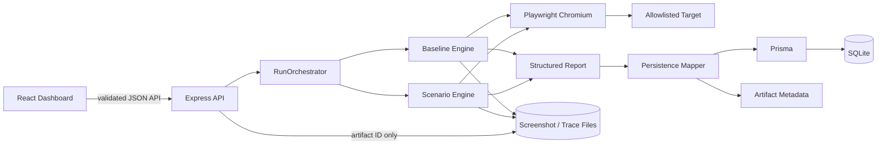
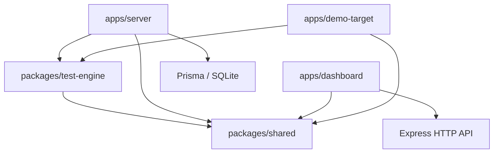

# GhostQA V1 Architecture

GhostQA is an npm-workspace monorepo with explicit separation between product
configuration, browser execution, orchestration, persistence, and presentation.

## Runtime flow



A run is created before execution. The orchestrator revalidates the project's
target host, executes and persists the baseline, stops on baseline failure, then
executes enabled scenarios sequentially. Target behavior failures remain
individual `FAIL` results; browser/engine/orchestration failures use `ERROR`.
Exceptions finalize the already-created run and preserve completed results.

## Dependency direction



`packages/test-engine` does not import Prisma, Express, React, or demo fixture
code. The dashboard never imports the test engine or accesses SQLite/artifact
paths directly.

## Workspaces

### `packages/shared`

Stable TypeScript contracts for normalized flows, five scenario families,
execution requests/reports, evidence, persisted results, runs, projects, and API
errors. It contains no target-specific fixtures and no runtime dependencies.

### `packages/test-engine`

Persistence-free Playwright execution. It validates targets and normalized
configuration, launches Chromium, creates an isolated context for every
baseline/scenario execution, applies typed behavior/fault injection, collects
network and browser observations, classifies conservatively, and finalizes
screenshots/traces and browser resources in error paths.

### `apps/server`

Express owns the public application boundary:

- Zod validation before persistence or execution;
- exact target-host authorization and HTTP(S)/credential checks;
- project, flow, scenario, run, result, and artifact APIs;
- synchronous in-process `RunOrchestrator` execution;
- report-to-Prisma mapping and validated JSON serialization;
- SQLite persistence and filesystem artifact metadata;
- narrowly configured dashboard CORS and safe JSON errors.

Prisma models are `Project`, `Flow`, `FlowStep`, `Scenario`, `TestRun`,
`TestResult`, and `Artifact`. Nested browser observations remain typed JSON.
Binary screenshots and trace ZIPs are never stored in SQLite.

Artifact downloads accept only a database artifact ID. Persisted relative paths
are resolved lexically and through the real filesystem, then checked against the
configured artifact root to prevent traversal and symlink escape.

### `apps/dashboard`

React, Vite, Tailwind CSS, React Router, and TanStack Query provide project and
flow configuration, scenario enablement, run initiation/history, result
summaries, structured evidence, screenshot viewing, and trace download. All
displayed run data comes from the API. Sensitive fill values are masked in the
normal flow view.

### `apps/demo-target`

GhostShop is a deliberately buggy local fixture plus deterministic seed and
real-browser proof commands. Its product names, routes, credentials, selectors,
and expected observations stay here. It is not a dependency of the reusable
engine, server, shared contracts, or dashboard.

## Execution lifecycle

```text
Create RUNNING TestRun
  -> validate target and persisted configuration
  -> execute baseline in isolated Chromium context
  -> persist baseline report and artifact metadata
  -> stop as BASELINE_FAILED or ERROR when baseline does not pass
  -> execute each enabled scenario sequentially in a fresh context
  -> persist each completed result
  -> calculate scenario counts
  -> finalize COMPLETED
```

If a later execution step throws, the run is finalized as `ERROR`; previously
persisted baseline/scenario results and their counts remain queryable.

## Safety boundary

V1 runs only against localhost or exact staging hosts explicitly configured by
the developer. It rejects wildcard target hosts, unsupported protocols, and
embedded URL credentials. Scenario schemas expose controlled actions and
observations, not arbitrary JavaScript. Network request/response bodies are not
captured. API clients receive stable error codes and no raw stack traces.

## Deployment model

V1 is a portfolio-quality local/staging application: one Express process,
sequential Chromium execution, SQLite, and local filesystem artifacts. Queues,
distributed workers, hosted infrastructure, authentication, AI, CI/CD, and
additional browser engines are intentionally outside scope.
