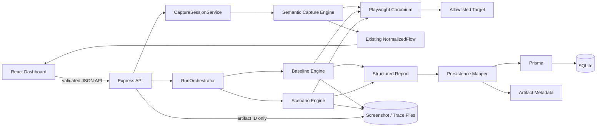
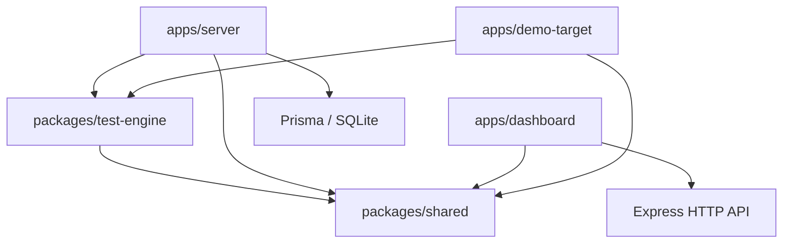
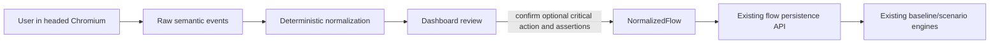

# GhostQA V1 Architecture

GhostQA is an npm-workspace monorepo with explicit separation between product
configuration, browser execution, orchestration, persistence, and presentation.

## Runtime flow



A run is created before execution. The orchestrator revalidates the project's
target host, executes and persists the baseline, stops on baseline failure, then
executes enabled scenarios sequentially. Target behavior failures remain
individual `FAIL` results; browser/engine/orchestration failures use `ERROR`.
Exceptions finalize the already-created run and preserve completed results.

## Dependency direction



`packages/test-engine` does not import Prisma, Express, React, or demo fixture
code. The dashboard never imports the test engine or accesses SQLite/artifact
paths directly.

## Interactive capture lifecycle



The persistence-free capture engine installs DOM listeners in a dedicated
Chromium context. It coalesces complete fills, records meaningful clicks and
selects, observes URL boundaries, and retains only request method, pathname,
status, and time. Locator selection prefers unique role/name, label, test ID,
visible text, then a stable unique ID/name CSS fallback. Clearly generated URL
path identifiers are wildcarded for repeatable replay.

The Express `CaptureSessionService` owns in-memory session lifetime, project
lookup, target reauthorization, stop/cancel/error cleanup, and transient review
drafts. Capture is never persisted automatically. The reviewed draft is turned
into the same `NormalizedFlow` contract and saved through the existing flow API.
A critical action is optional. Step-bound flow assertions are evaluated
immediately after their referenced step; the original `successAssertion`
remains an optional backward-compatible final assertion.
Capture navigation to a hostname outside the exact allowlist is blocked and
ends the session; opening another browser page also ends the V1 capture.

## Workspaces

### `packages/shared`

Stable TypeScript contracts for normalized flows, five scenario families,
execution requests/reports, evidence, persisted results, runs, projects, and API
errors. It contains no target-specific fixtures and no runtime dependencies.

### `packages/test-engine`

Persistence-free Playwright execution and semantic baseline capture. It
validates targets and normalized configuration, launches Chromium, normalizes
capture events into the existing flow model, creates isolated execution
contexts, applies typed behavior/fault injection, collects observations,
classifies conservatively, and finalizes browser resources in error paths.

### `apps/server`

Express owns the public application boundary:

- Zod validation before persistence or execution;
- exact target-host authorization and HTTP(S)/credential checks;
- project, flow, scenario, run, result, and artifact APIs;
- transient baseline-capture session APIs and headed-browser cleanup;
- synchronous in-process `RunOrchestrator` execution;
- report-to-Prisma mapping and validated JSON serialization;
- SQLite persistence and filesystem artifact metadata;
- narrowly configured dashboard CORS and safe JSON errors.

Prisma models are `Project`, `Flow`, `FlowStep`, `Scenario`, `TestRun`,
`TestResult`, and `Artifact`. Nested browser observations remain typed JSON.
Binary screenshots and trace ZIPs are never stored in SQLite.

The server also owns the deterministic focused-plan recommendation layer. It
derives a small default selection from normalized steps, the user-selected
critical action/request, URL transitions, and confirmed locators/assertions.
Only safely inferred navigation expectations are selected, and Session Expiry
is never enabled without explicit authentication configuration. The dashboard
maps the focused plan and manual overrides back to the existing validated
`ScenarioDefinition` contracts; there is no second execution model.

Double Action inspects only small successful JSON responses in memory, chooses
a conservative top-level identifier candidate, and persists only field/source
metadata plus SHA-256 prefixes. API Failure and Slow Response derive a
runtime-only stable control fallback before activation so accessible-name
changes do not hide pending/stuck state. They persist state booleans and text
change indicators, never response bodies or control text.

Artifact downloads accept only a database artifact ID. Persisted relative paths
are resolved lexically and through the real filesystem, then checked against the
configured artifact root to prevent traversal and symlink escape.

### `apps/dashboard`

React, Vite, Tailwind CSS, React Router, and TanStack Query provide project and
flow configuration, scenario enablement, run initiation/history, result
summaries, structured evidence, screenshot viewing, and trace download. All
displayed run data comes from the API. Sensitive fill values are masked in the
normal flow view. The compact capture review supports deletion/reordering,
locator/value correction, optional critical-action selection, multiple
step-bound `TEXT_VISIBLE` assertions, and an optional legacy final assertion.
The flow page can replay only the baseline and review a focused test plan before
optionally customizing it. A project page lists every independent journey and
starts first/additional captures against the same project. JSON imports remain
available in Advanced mode.

### `apps/demo-target`

GhostShop is a deliberately buggy local fixture plus deterministic seed and
real-browser proof commands. Its product names, routes, credentials, selectors,
and expected observations stay here. It is not a dependency of the reusable
engine, server, shared contracts, or dashboard.

## Execution lifecycle

```text
Create RUNNING TestRun
  -> validate target and persisted configuration
  -> execute baseline in isolated Chromium context
  -> persist baseline report and artifact metadata
  -> stop as BASELINE_FAILED or ERROR when baseline does not pass
  -> execute each enabled scenario sequentially in a fresh context
  -> persist each completed result
  -> calculate scenario counts
  -> finalize COMPLETED
```

If a later execution step throws, the run is finalized as `ERROR`; previously
persisted baseline/scenario results and their counts remain queryable.

## Safety boundary

V1 runs only against localhost or exact staging hosts explicitly configured by
the developer. It rejects wildcard target hosts, unsupported protocols, and
embedded URL credentials. Scenario schemas expose controlled actions and
observations, not arbitrary JavaScript. Network request/response bodies are not
captured. API clients receive stable error codes and no raw stack traces.

Capture sessions are local and transient: active sessions expire after 30
minutes and terminal drafts are retained in memory for one hour. Restarting the
server discards them. Password fields are tagged sensitive and visually masked;
their values are still stored in local flow JSON/SQLite because replay requires
them. V1 deliberately has no secrets vault or at-rest encryption.

## Deployment model

V1 is a portfolio-quality local/staging application: one Express process,
sequential Chromium execution, SQLite, and local filesystem artifacts. Queues,
distributed workers, hosted infrastructure, authentication, AI, CI/CD, and
additional browser engines are intentionally outside scope.
