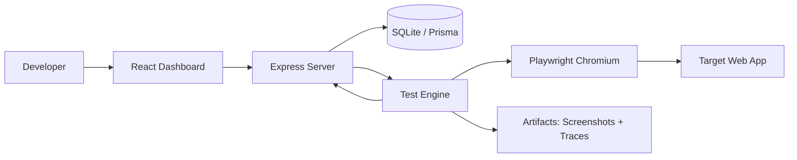

# GhostQA Architecture

## High-level architecture

## Components

### apps/dashboard
React + TypeScript + Vite + Tailwind UI.

Responsibilities:
- project management
- baseline flow configuration
- generated test plan
- run progress
- result/evidence visualization

### apps/server
Node.js + TypeScript + Express API.

Responsibilities:
- validation
- orchestration
- persistence
- target allowlisting
- starting test runs
- serving run/result metadata

### packages/test-engine
Reusable Playwright logic.

Responsibilities:
- baseline execution
- scenario execution
- isolated browser contexts
- network interception
- console capture
- screenshots/traces
- evidence collection
- deterministic result classification helpers

The engine must not depend on GhostShop-specific selectors or routes.

### packages/shared
Shared TypeScript contracts and schemas.

Examples:
- Project
- Flow
- FlowStep
- Scenario
- TestRun
- TestResult
- Evidence

### apps/demo-target
GhostShop Demo, a deliberately buggy local web app used as a test fixture.

It must remain separate from the GhostQA engine. Never hard-code the engine around GhostShop.

## Data model direction

Expected core entities:

- Project
- Flow
- FlowStep
- Scenario
- TestRun
- TestResult
- Artifact

Exact Prisma schema can be refined during implementation.

## Important boundary

Target application failures and GhostQA engine failures are different concepts and must be represented separately.
